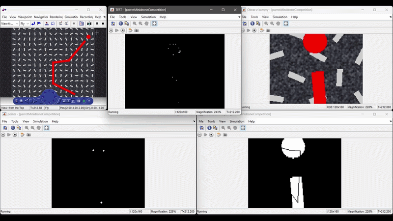

# Autonomous Vision-Based Line-Follower UAV Navigation System 

## Overview

This repository contains a complete MATLAB/Simulink-based control system designed for autonomous line following drone navigation (target hardware: Parrot Mambo). The project utilizes classical computer vision techniques, deterministic state machines, and PID controllers to enable a drone to autonomously follow a visual path, navigate sharp turns, and perform precision landing on a designated marker.

Detailed informations

## Key Features

* **Real-Time Computer Vision:** Processes camera feed using morphological operations (thinning, spurring, cleaning) to extract a 1-pixel wide flight path skeleton, eliminating noise and visual artifacts.
* **Custom Geometric Regression Algorithm:** Implements a split-and-merge approach to analyze the global shape of the path line. This ensures robust, noise-resistant detection of corners and intersections without relying on unstable local feature extraction.
* **Blob Analysis for Precision Landing:** Utilizes mathematical shape analysis (area, eccentricity, bounding box proportions) to accurately distinguish the circular landing pad from the main track, allowing for precise centroid tracking during descent.
* **Deterministic Mission Logic (Stateflow):** A robust state machine that seamlessly orchestrates complex mission phases: finding the line, tracking the line, executing 90-degree turns, and overriding standard navigation to execute a landing sequence when the target is acquired.
* **PID Flight Control:** Calculates precise forward, lateral, and vertical velocity vectors to minimize cross-track error (CTE) and maintain the drone perfectly centered over the path or landing zone.
* **Independent Quality Analysis Module:** A dedicated diagnostic system that continuously measures the Euclidean distance (in pixels) between the camera center and the ideal path, incorporating a deadband tolerance to evaluate the stability of the control loops.

## System Architecture

The Simulink model is divided into several core subsystems:

1. **Image Processing Subsystem:** * Converts raw RGB video into binary images.
* Extracts object properties (Area, Centroid, Eccentricity) using Blob Analysis.
* Reduces thick lines to single-pixel skeletons using `bwmorph` operations.

2. **Path Planning (Stateflow):**
* Uses central-state logic: the main state analyses the drones status and runs according action 
* The main state acts as the brain of the drone. Analyzes coordinates provided by the vision system to determine the current flight state.
* Includes states such as `FindTheLine`, `FollowLine`, `Turn`, and `Landing` (which acts as a high-priority interrupt).

3. **Control System:**
* Translates visual errors (camera center vs. target coordinate) into drone velocity commands using proportional control logic with saturation limits for safety.

4. **Quality Assessment:**
* Runs in parallel to the main control loop. Outputs raw position error, tolerance-adjusted error, and binary flags indicating perfect path alignment.

## Detailed Documentation
For a comprehensive overview of the system architecture, control logic flowcharts, and quantitative performance analysis (including Cross Track Error graphs and literature comparison), please refer to the official project report included in this repository:

* **[raport_Karpiński_Grudziński.pdf](raport_Karpiński_Grudziński.pdf)** *(Note: The report is written in Polish).*

## Prerequisites

To run and modify this simulation, the following software is required:

* MATLAB (R2024b recommended)
* Simulink
* Stateflow
* Computer Vision Toolbox
* Image Processing Toolbox
* MATLAB Coder / Simulink Coder (for generating C/C++ code)
* Simulink Support Package for Parrot Minidrones (if deploying to actual hardware)

## Future Work

* **Fuzzy Logic Control:** Replacing or augmenting the current PID controllers with fuzzy logic to eliminate oscillations and provide smoother trajectory corrections.
* **Advanced Filtering:** Further optimization of the image processing pipeline to handle variable lighting conditions and dynamic shadows.
* **Hardware Deployment:** Transitioning the algorithms from the physics simulation environment to real-world testing on the Parrot Mambo drone.

